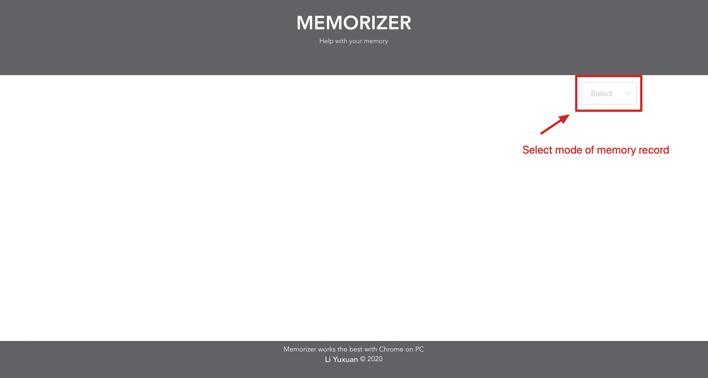
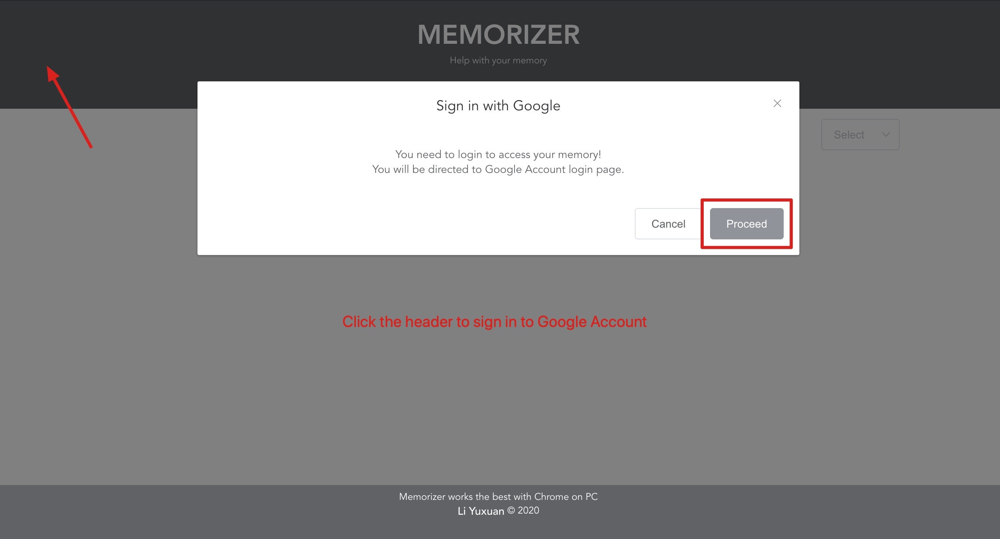
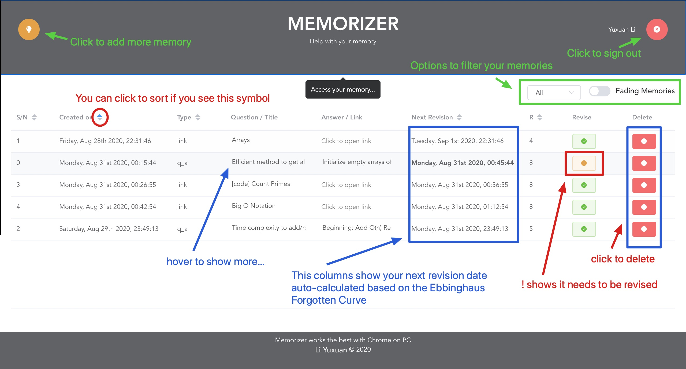
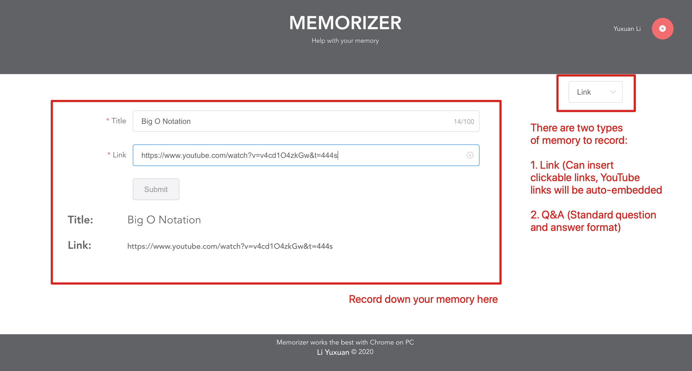
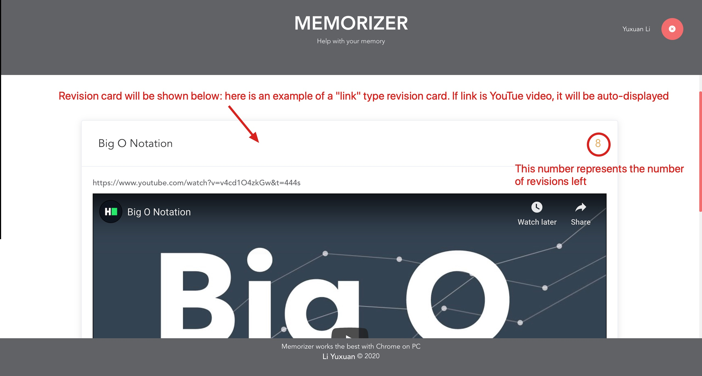
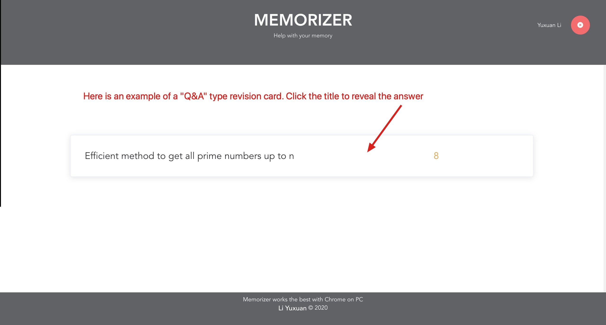
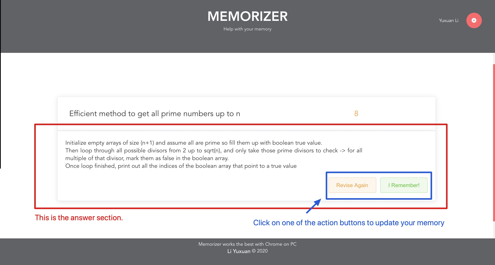

# Memorizer
**Version 1.0.2**

The manager of your fading memories.
https://xmliszt.github.io/memorizer

## Introduction
Memorizer is a Vue website running on GitHub Page that uses Google Firestore as database. It uses the [Ebbinghaus Forgetting Curve](https://en.wikipedia.org/wiki/Forgetting_curve) to auto-calculate your revision schedule.

You can create two types of revision cards:

1. Q&A: the standard type of revision card that provides a question and an answer.
2. Link: special revision card which accepts a valid URL as the resource. When you revise this kind of card, simply click the link to be directed to the source. **If your link is a YouTube video link, it can be played on the website itself as embedded link**

## What's New!
- Added search bar for memories. Now you can search to find the memory you want quickly!

## How to use Memorizer?
Here is a detailed screenshoted examples to guide you through the application:

## Contributions

Memorizer is welcoming more talented minds to help make it better! To contribute, please fork this repo and submit an **issue** or **pull request**. Thank you for your support!

---
## Contributors
- Li Yuxuan <xmliszt@gmail.com>
---

## License & copyright

© Li Yuxuan, Singapore University of Technology and Design

Licensed under the [MIT License](LICENSE).